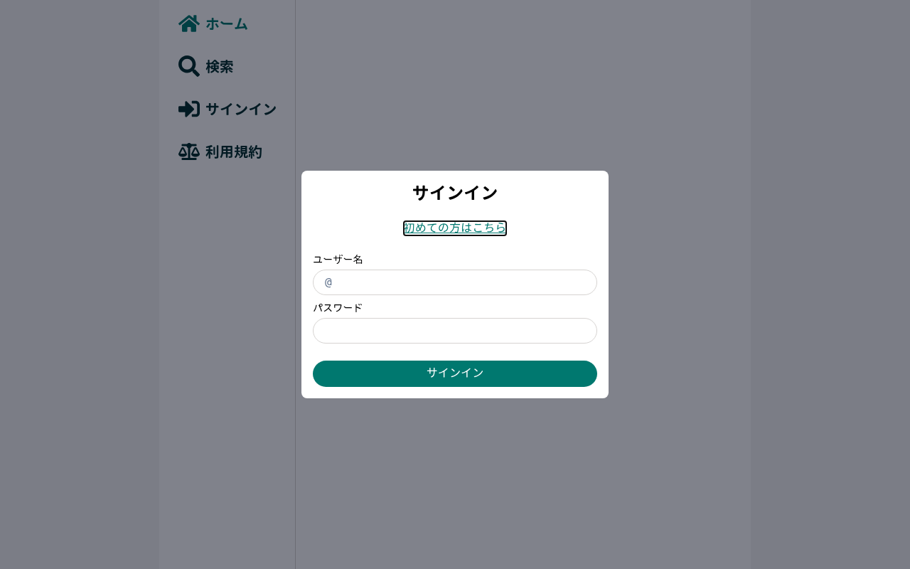

# サインイン・新規登録テスト

*2026-03-20T09:56:46Z*

検証項目:
1. 新規登録: バリデーション、登録成功、既存ユーザーエラー
2. サインイン: バリデーション、成功、失敗エラー
3. サインアウト

```bash {image}
uvx rodney screenshot -w 1280 -h 800 06-auth-signin-modal.png && echo 06-auth-signin-modal.png
```



### サインイン: ⚠️ PARTIAL
- モーダル表示: ✅ PASS
- フォーム入力・送信: ✅ PASS (API 200)
- モーダル閉じ + サインアウトボタン出現: ❌ FAIL
  - モーダルは閉じるがサイドバーが更新されない

### SSR エラー発見
SSRで `<Helmet> component must be within a <HelmetProvider> children tree` エラーが発生。
これが投稿詳細・検索ページなどでコンテンツが表示されない根本原因の可能性。

## サインイン テスト結果サマリ

| # | 項目 | 結果 |
|---|------|------|
| 1 | モーダル表示 | ✅ PASS |
| 2 | サインイン成功 → サインアウトボタン | ❌ FAIL |
| 3 | サインイン失敗エラー | ⏸️ UNTESTED |
| 4 | 新規登録 | ⏸️ UNTESTED |
| 5 | サインアウト | ⏸️ UNTESTED |
